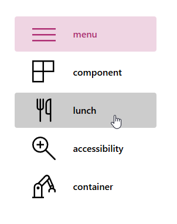
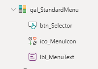
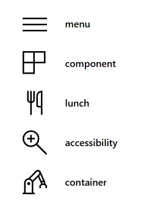
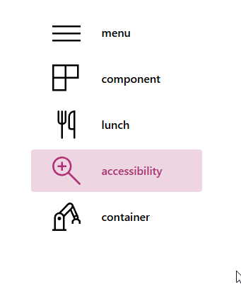
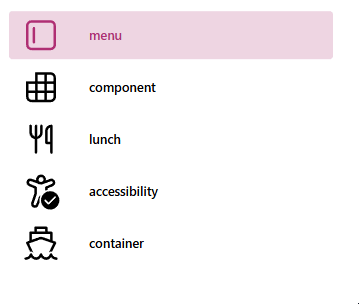
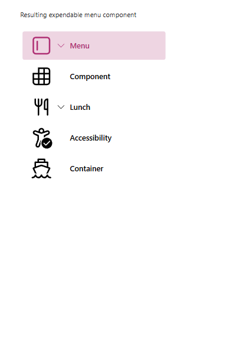

# Exercise 1: Building the menu

In the first exercise we will build a menu with icons that you can reuse in many different apps.




## [Main Quests overview](#user-content-main-quests)

1. [Create a menu collection](#user-content-create-a-menu-collection)
2. [Create a gallery](#user-content-create-a-gallery)
3. [Use the OnSelect-property properly](#user-content-use-the-onselect-property)
4. [Highlight the selected menu item](#user-content-highlight-the-selected-menu-item)

## [Side quests overview](#user-content-side-quests)

1. [Throw in the real svg's](#user-content-throw-in-the-real-svgs)
2. [Make it expandable](#user-content-the-expandables)

## Main quests

Create an empty Canvas App from scratch in an environment of your choice. We WON'T use any special features that may be blocked by your admins. So don't worry, every environment will do.

### Create a menu collection

First, we need to create a Power FX collection, that contains all the information we see in the menu.

We will need:
* an ID (will be important for the OnSelect-property, stay tuned!)
* the label
* an icon that roughly matches our text (we will use internal Power Apps icons in the first quick iteration)

Add this piece of code to the `OnStart`-property of your App and run it.

```
ClearCollect(colMenu,
    {id: 1, text: "menu", icon: Icon.Hamburger},
    {id: 2, text: "component", icon: Icon.Items},
    {id: 3, text: "lunch", icon: Icon.ForkKnife},
    {id: 4, text: "accessibility", icon: Icon.ZoomIn},
    {id: 5, text: "container", icon: Icon.Manufacture}
);
```

### Create a gallery

We will create a simple gallery with an icon in the background and a transparent button in front of it.

**Insert a `Blank vertical gallery`**
* Set the `Items` property to `colMenu`
* Set the `TemplateSize` to `58`
* Set the `TemplatePadding` to `0`

**Insert an `Icon` inside the gallery**
* Set the `Color` to `Color.Black`
* Set the `Icon`-property to `ThisItem.icon`

**Insert a `Label` inside the gallery**
* Place it next to the button
* Set the `Text` to `ThisItem.text`

**Insert a `Button` inside the gallery**
* Set the `Height` to `Parent.TemplateHeight`
* Set the `Width` to `Parent.TemplateWidth`
* Set `X` and `Y` to `0`
* Set the `Fill` to `Color.Transparent`
* Set the `Color` to `Color.Black`
* Adjust the other Color properties

The tree view of our gallery should look like this (after renaming the elements)



Add some finishing touches to the gallery styling and your result should look like this



### Use the OnSelect-property

Of course we created the menu to click on the buttons. We have 5 menu items so far, but only one button we can work with.

We will use this code on the button inside the gallery on the `OnSelect`-property.

First we remember which item we clicked and store it in `gblSelected`. We will use this to highlight our selected item in the next step.

Afterwards we use `Switch()` to distinguish between the actions between clicking button 1 to 5. Those could navigate to different screens, open modal windows or do whatever we need in our apps.

```
Set(gblSelected, ThisItem.id);

//This is the immediate action that happen on the click
Switch(ThisItem.id,
    //click on 1st menu item
    1, Notify("ACTION"),

    //click on 2nd menu item
    2, Notify("DIFFERENT ACTION", NotificationType.Success),

    //click on 3rd menu item
    3, Notify("Even more ACTION", NotificationType.Error)

    //... repeat till 5
)
```

### Highlight the selected menu item

In order to highlight the selected item we want to change the button `Fill` to a semi-transparent version of a color.

We will use this code on the `Fill` property of the button.

```
If(
    ThisItem.id = gblSelected,
    ColorValue("#ff69b433"),
    Color.Transparent
)
```

Use similar formulas to change the color of the icon and text.

This should give us this effect after clicking on a menu item.



**2 additional tips:**
* use formulas for colours you need frequently, for example `primaryColor = App.Theme.Colors.Primary;` for an easy way to get to the primary Color of a modern theme
* extract the Hex-Values of Power Apps colors to use them in SVG or html elements in your app or create a transparent version of the color. The `JSON` formula can help you here: `ColorValue(Mid(JSON(App.Theme.Colors.Primary), 2,7)&"33")` (you can also store them as a formula)


## Side quests

### Throw in the real svg's

The built in icons don't look too nice and there is only a pretty limited selection of different icons available. So let's try to replace them with SVG images.
We will need to expand our collection a bit for all the information we need. You can either chose your own images or take the ones that we prepared for you.

The new `colMenuSVG` looks like this:

```
ClearCollect(colMenuSVG,
    {id: 1, text: "menu", icon: Icon.Hamburger, svg: "<svg width='24' height='24' xmlns='http://www.w3.org/2000/svg'><path d='M17.75 3A3.25 3.25 0 0 1 21 6.25v11.5A3.25 3.25 0 0 1 17.75 21H6.25A3.25 3.25 0 0 1 3 17.75V6.25A3.25 3.25 0 0 1 6.25 3h11.5Zm0 1.5H6.25A1.75 1.75 0 0 0 4.5 6.25v11.5c0 .966.784 1.75 1.75 1.75h11.5a1.75 1.75 0 0 0 1.75-1.75V6.25a1.75 1.75 0 0 0-1.75-1.75ZM7.75 7a.75.75 0 0 1 .743.648l.007.102v8.5a.75.75 0 0 1-1.493.102L7 16.25v-8.5A.75.75 0 0 1 7.75 7Z'/></svg>"},
    {id: 2, text: "component", icon: Icon.Items, svg: "<svg width='24' height='24' viewBox='0 0 24 24' xmlns='http://www.w3.org/2000/svg'><path d='M3 8.5v9.25A3.25 3.25 0 0 0 6.25 21h11.5A3.25 3.25 0 0 0 21 17.75V6.25A3.25 3.25 0 0 0 17.75 3H8.5v5.5H3ZM8.5 10v4h-4v-4h4Zm1.5 4v-4h4v4h-4Zm5.5 0v-4h4v4h-4ZM10 15.5h4v4h-4v-4Zm5.5 0h4v2.25a1.75 1.75 0 0 1-1.75 1.75H15.5v-4Zm0-11h2.25c.966 0 1.75.784 1.75 1.75V8.5h-4v-4Zm-1.5 4h-4v-4h4v4Zm-5.5 7v4H6.25a1.75 1.75 0 0 1-1.75-1.75V15.5h4Z'/></svg>"},
    {id: 3, text: "lunch", icon: Icon.ForkKnife, svg: "<svg width='24' height='24' viewBox='0 0 24 24' xmlns='http://www.w3.org/2000/svg'><path d='M18.25 3.25a.75.75 0 0 1 .743.648L19 4v16a.75.75 0 0 1-1.493.102L17.5 20v-5h-2.25a.75.75 0 0 1-.743-.648l-.007-.102V7a3.75 3.75 0 0 1 3.75-3.75Zm-6 0a.75.75 0 0 1 .743.648L13 4v4c0 1.953-1.4 3.578-3.25 3.93V20a.75.75 0 0 1-1.493.102L8.25 20v-8.07a4.002 4.002 0 0 1-3.245-3.722L5 8V4a.75.75 0 0 1 1.493-.102L6.5 4v4c0 1.12.736 2.067 1.75 2.386V4a.75.75 0 0 1 1.493-.102L9.75 4v6.385a2.502 2.502 0 0 0 1.743-2.2L11.5 8V4a.75.75 0 0 1 .75-.75ZM17.5 13.5V4.878a2.252 2.252 0 0 0-1.494 1.95L16 7v6.5h1.5V4.878 13.5Z' /></svg>"},
    {id: 4, text: "accessibility", icon: Icon.ZoomIn, svg: "<svg width='24' height='24' viewBox='0 0 24 24' xmlns='http://www.w3.org/2000/svg'><path d='M9.04 5.493a3 3 0 1 1 5.918.002l2.433-.908a2.359 2.359 0 0 1 1.766 4.372L16 10.334v.84a6.456 6.456 0 0 0-1.5.558V9.843a.75.75 0 0 1 .45-.688l3.608-1.57a.858.858 0 0 0-.643-1.592l-4.78 1.783c-.35.143-.734.222-1.135.222a2.99 2.99 0 0 1-1.17-.237L5.936 5.936a.85.85 0 0 0-.64 1.574l3.755 1.653a.75.75 0 0 1 .448.686v3.735a.75.75 0 0 1-.041.245L7.536 19.4a.82.82 0 0 0 1.545.549l1.65-4.527c.174-.478.551-.764.967-.857a6.526 6.526 0 0 0-.58 4.174l-.628 1.723a2.32 2.32 0 0 1-4.372-1.55L8 13.457v-3.12L4.693 8.884A2.35 2.35 0 0 1 6.461 4.53l2.58.962Zm1.46-.495a1.5 1.5 0 0 0 .896 1.373 1.75 1.75 0 0 0 1.187.01A1.5 1.5 0 1 0 10.5 4.997ZM23 17.5a5.5 5.5 0 1 1-11 0 5.5 5.5 0 0 1 11 0Zm-2.146-2.354a.5.5 0 0 0-.708 0L16.5 18.793l-1.646-1.647a.5.5 0 0 0-.708.708l2 2a.5.5 0 0 0 .708 0l4-4a.5.5 0 0 0 0-.708Z' /></svg>"},
    {id: 5, text: "container", icon: Icon.Manufacture, svg: "<svg width='24' height='24' viewBox='0 0 24 24' xmlns='http://www.w3.org/2000/svg'><path d='M8.75 2a.75.75 0 0 0-.75.75V5H5.75a.75.75 0 0 0-.75.75v4.764l-1.46.535a.75.75 0 0 0-.423 1.02l2.335 5.019a1.749 1.749 0 0 1 1.924.581l-2.554-5.492 6.587-2.412a1.75 1.75 0 0 1 1.19-.005l6.775 2.418-2.622 5.345a1.749 1.749 0 0 1 1.871-.408l2.468-5.031a.75.75 0 0 0-.421-1.037L19 10.451V5.75a.75.75 0 0 0-.75-.75H16V2.75a.75.75 0 0 0-.75-.75h-6.5Zm5.75 3h-5V3.5h5V5Zm3 1.5v3.416l-4.397-1.569a3.25 3.25 0 0 0-2.21.01L6.5 9.964V6.5h11ZM18.727 18.564l-.003-.01a.75.75 0 0 0-1.441-.023v.002l-.004.009-.02.058a3.854 3.854 0 0 1-.517.95c-.387.515-.939.95-1.742.95s-1.356-.435-1.743-.95a3.851 3.851 0 0 1-.538-1.009l-.003-.009a.75.75 0 0 0-1.435.001v.001l-.004.01a3.36 3.36 0 0 1-.115.29c-.089.198-.227.46-.42.716-.385.515-.936.95-1.742.95-.806 0-1.358-.435-1.744-.95a3.834 3.834 0 0 1-.535-1.007l-.003-.011a.75.75 0 0 0-1.441.02l-.003.009-.018.054a3.301 3.301 0 0 1-.504.922c-.384.49-.996.963-2.002.963a.75.75 0 0 0 0 1.5c1.574 0 2.587-.777 3.183-1.537L6 20.374l.056.076C6.608 21.185 7.556 22 9 22s2.392-.815 2.943-1.55l.057-.078.058.079C12.61 21.185 13.558 22 15 22c1.442 0 2.39-.815 2.942-1.55l.055-.075c.021.03.043.058.066.087.595.761 1.61 1.538 3.187 1.538a.75.75 0 0 0 0-1.5c-1.012 0-1.623-.473-2.005-.962a3.267 3.267 0 0 1-.518-.974Z'/></svg>"}
);
```

To display the svg-paths we can add an `Image` control to the gallery instead of the icons and add this code to the `Image` property, which will display the normal icon:
```
"data:image/svg+xml;utf8, " 
& EncodeUrl(ThisItem.svg)"
```

If you want to read more about that topic [Matthew Devaney has got you covered](https://www.matthewdevaney.com/svg-images-in-power-apps/).

For an extra challenge also try to add some color to the selected icons!

The finished product should look like this:



### The expandables

Add optional expandable/collapsible sections to your menu:



Side note:
There are many different ways to achieve this. In the solution file uses a single gallery, you could also use nested galleries and a flexible height gallery for the outer one.

You can use this collection as a starting point:
```
ClearCollect(colExpandableMenuSVG,
    {id: 1, expandable: true, expanded: false, text: "Menu", icon: Icon.Hamburger, svg: "<svg width='24' height='24' xmlns='http://www.w3.org/2000/svg'><path d='M17.75 3A3.25 3.25 0 0 1 21 6.25v11.5A3.25 3.25 0 0 1 17.75 21H6.25A3.25 3.25 0 0 1 3 17.75V6.25A3.25 3.25 0 0 1 6.25 3h11.5Zm0 1.5H6.25A1.75 1.75 0 0 0 4.5 6.25v11.5c0 .966.784 1.75 1.75 1.75h11.5a1.75 1.75 0 0 0 1.75-1.75V6.25a1.75 1.75 0 0 0-1.75-1.75ZM7.75 7a.75.75 0 0 1 .743.648l.007.102v8.5a.75.75 0 0 1-1.493.102L7 16.25v-8.5A.75.75 0 0 1 7.75 7Z'/></svg>"},
    {id: 11, childitem: true, text: "Collection", parent: 1, show: false},
    {id: 12, childitem: true, text: "Icon", parent: 1, show: false},
    {id: 13, childitem: true, text: "Component", parent: 1, show: false},
    {id: 2, text: "Component", icon: Icon.Items, svg: "<svg width='24' height='24' viewBox='0 0 24 24' xmlns='http://www.w3.org/2000/svg'><path d='M3 8.5v9.25A3.25 3.25 0 0 0 6.25 21h11.5A3.25 3.25 0 0 0 21 17.75V6.25A3.25 3.25 0 0 0 17.75 3H8.5v5.5H3ZM8.5 10v4h-4v-4h4Zm1.5 4v-4h4v4h-4Zm5.5 0v-4h4v4h-4ZM10 15.5h4v4h-4v-4Zm5.5 0h4v2.25a1.75 1.75 0 0 1-1.75 1.75H15.5v-4Zm0-11h2.25c.966 0 1.75.784 1.75 1.75V8.5h-4v-4Zm-1.5 4h-4v-4h4v4Zm-5.5 7v4H6.25a1.75 1.75 0 0 1-1.75-1.75V15.5h4Z'/></svg>"},
    {id: 3, expandable: true, expanded: false, text: "Lunch", icon: Icon.ForkKnife, svg: "<svg width='24' height='24' viewBox='0 0 24 24' xmlns='http://www.w3.org/2000/svg'><path d='M18.25 3.25a.75.75 0 0 1 .743.648L19 4v16a.75.75 0 0 1-1.493.102L17.5 20v-5h-2.25a.75.75 0 0 1-.743-.648l-.007-.102V7a3.75 3.75 0 0 1 3.75-3.75Zm-6 0a.75.75 0 0 1 .743.648L13 4v4c0 1.953-1.4 3.578-3.25 3.93V20a.75.75 0 0 1-1.493.102L8.25 20v-8.07a4.002 4.002 0 0 1-3.245-3.722L5 8V4a.75.75 0 0 1 1.493-.102L6.5 4v4c0 1.12.736 2.067 1.75 2.386V4a.75.75 0 0 1 1.493-.102L9.75 4v6.385a2.502 2.502 0 0 0 1.743-2.2L11.5 8V4a.75.75 0 0 1 .75-.75ZM17.5 13.5V4.878a2.252 2.252 0 0 0-1.494 1.95L16 7v6.5h1.5V4.878 13.5Z' /></svg>"},
    {id: 31, childitem: true, text: "Starter", parent: 3, show: false},
    {id: 32, childitem: true, text: "Main Course", parent: 3, show: false},
    {id: 33, childitem: true, text: "Desert", parent: 3, show: false},
    {id: 4, text: "Accessibility", icon: Icon.ZoomIn, svg: "<svg width='24' height='24' viewBox='0 0 24 24' xmlns='http://www.w3.org/2000/svg'><path d='M9.04 5.493a3 3 0 1 1 5.918.002l2.433-.908a2.359 2.359 0 0 1 1.766 4.372L16 10.334v.84a6.456 6.456 0 0 0-1.5.558V9.843a.75.75 0 0 1 .45-.688l3.608-1.57a.858.858 0 0 0-.643-1.592l-4.78 1.783c-.35.143-.734.222-1.135.222a2.99 2.99 0 0 1-1.17-.237L5.936 5.936a.85.85 0 0 0-.64 1.574l3.755 1.653a.75.75 0 0 1 .448.686v3.735a.75.75 0 0 1-.041.245L7.536 19.4a.82.82 0 0 0 1.545.549l1.65-4.527c.174-.478.551-.764.967-.857a6.526 6.526 0 0 0-.58 4.174l-.628 1.723a2.32 2.32 0 0 1-4.372-1.55L8 13.457v-3.12L4.693 8.884A2.35 2.35 0 0 1 6.461 4.53l2.58.962Zm1.46-.495a1.5 1.5 0 0 0 .896 1.373 1.75 1.75 0 0 0 1.187.01A1.5 1.5 0 1 0 10.5 4.997ZM23 17.5a5.5 5.5 0 1 1-11 0 5.5 5.5 0 0 1 11 0Zm-2.146-2.354a.5.5 0 0 0-.708 0L16.5 18.793l-1.646-1.647a.5.5 0 0 0-.708.708l2 2a.5.5 0 0 0 .708 0l4-4a.5.5 0 0 0 0-.708Z' /></svg>"},
    {id: 5, text: "Container", icon: Icon.Manufacture, svg: "<svg width='24' height='24' viewBox='0 0 24 24' xmlns='http://www.w3.org/2000/svg'><path d='M8.75 2a.75.75 0 0 0-.75.75V5H5.75a.75.75 0 0 0-.75.75v4.764l-1.46.535a.75.75 0 0 0-.423 1.02l2.335 5.019a1.749 1.749 0 0 1 1.924.581l-2.554-5.492 6.587-2.412a1.75 1.75 0 0 1 1.19-.005l6.775 2.418-2.622 5.345a1.749 1.749 0 0 1 1.871-.408l2.468-5.031a.75.75 0 0 0-.421-1.037L19 10.451V5.75a.75.75 0 0 0-.75-.75H16V2.75a.75.75 0 0 0-.75-.75h-6.5Zm5.75 3h-5V3.5h5V5Zm3 1.5v3.416l-4.397-1.569a3.25 3.25 0 0 0-2.21.01L6.5 9.964V6.5h11ZM18.727 18.564l-.003-.01a.75.75 0 0 0-1.441-.023v.002l-.004.009-.02.058a3.854 3.854 0 0 1-.517.95c-.387.515-.939.95-1.742.95s-1.356-.435-1.743-.95a3.851 3.851 0 0 1-.538-1.009l-.003-.009a.75.75 0 0 0-1.435.001v.001l-.004.01a3.36 3.36 0 0 1-.115.29c-.089.198-.227.46-.42.716-.385.515-.936.95-1.742.95-.806 0-1.358-.435-1.744-.95a3.834 3.834 0 0 1-.535-1.007l-.003-.011a.75.75 0 0 0-1.441.02l-.003.009-.018.054a3.301 3.301 0 0 1-.504.922c-.384.49-.996.963-2.002.963a.75.75 0 0 0 0 1.5c1.574 0 2.587-.777 3.183-1.537L6 20.374l.056.076C6.608 21.185 7.556 22 9 22s2.392-.815 2.943-1.55l.057-.078.058.079C12.61 21.185 13.558 22 15 22c1.442 0 2.39-.815 2.942-1.55l.055-.075c.021.03.043.058.066.087.595.761 1.61 1.538 3.187 1.538a.75.75 0 0 0 0-1.5c-1.012 0-1.623-.473-2.005-.962a3.267 3.267 0 0 1-.518-.974Z'/></svg>"}
)
```
 


