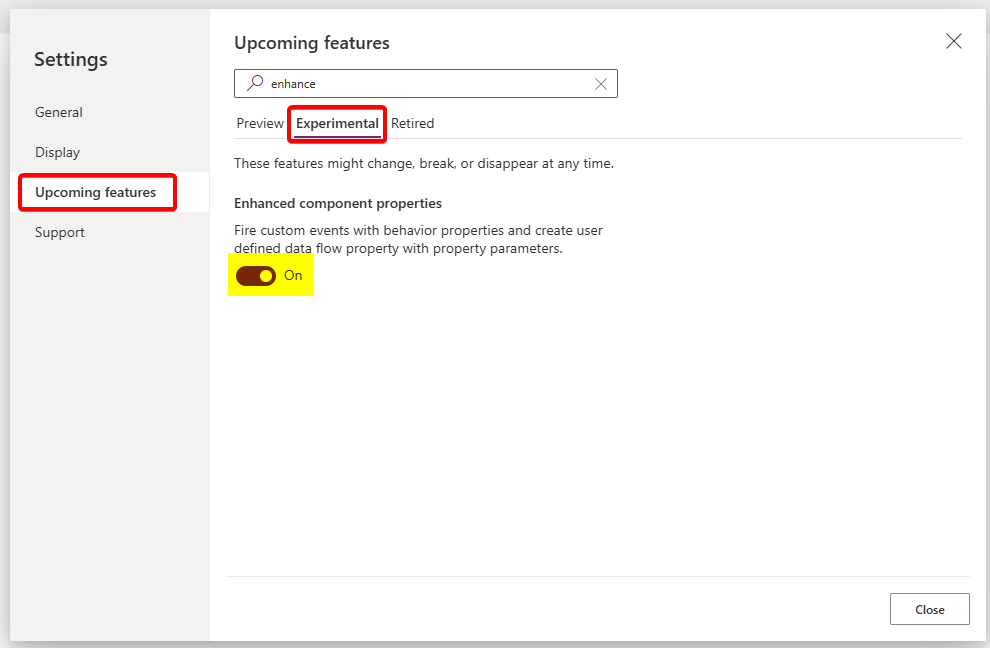
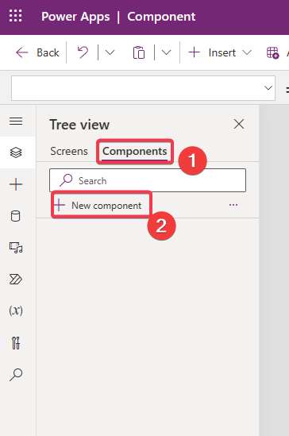
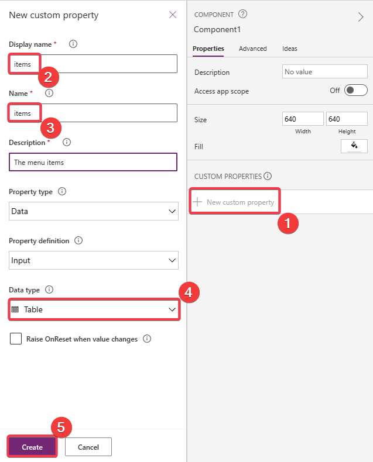
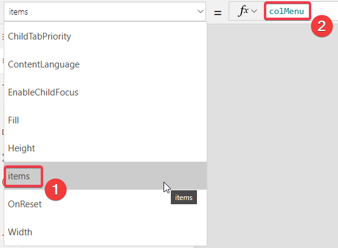
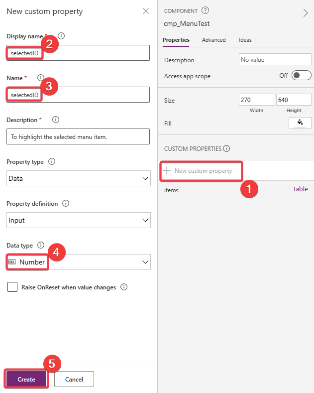
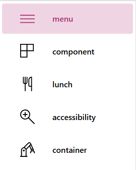
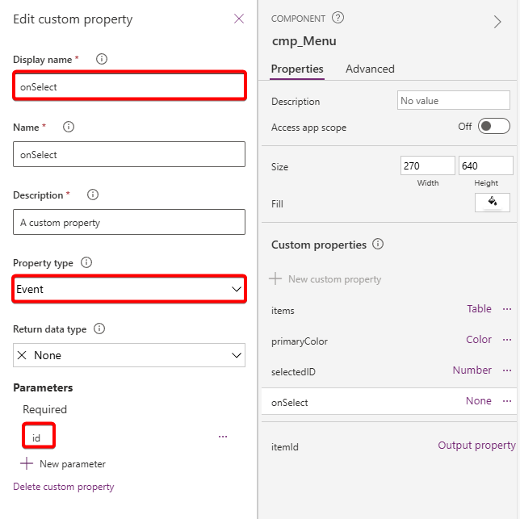
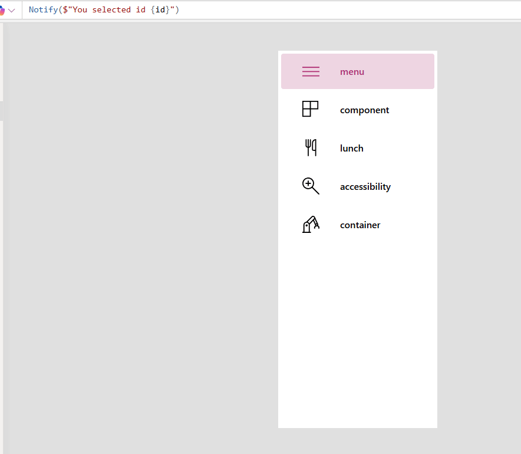
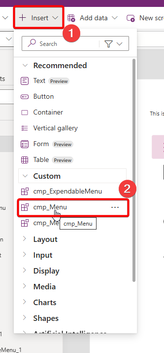

# Exercise 1-2: Turn the menu into a component

In the second exercise we will take our shiny menu and we'll turn it into a component to reuse it on multiple screens and apps.

## Main Quests overview

1. Create a component
2. Add properties to the component
3. Add a behavior property
4. Insert the component to your app

## Main quests

To prepare our app we first enable the **Enhanced component properties** in our app settings to use behavior properties later.

Switch that to on:



### 1. Create a component

We start by creating a new component in our app. We will call it `cmp_Menu`.



Set the **Width** to `270` and the **Height** to `640`. We can change those later, but it will roughly be the dimensions we need for the menu.

Now copy your existing gallery inside the component using `Ctrl + C` and `Ctrl + V`.

You should see nothing but a bunch of errors, so we'll fix that in the next step.

### 2. Add properties to the component

Inside the component our `colMenu` isn't recognized, because we didn't activate the **AccessAppScope** property on the component (and we won't do it).

We will pass everything we need as custom properties into the component. We will start with the menu items.

We add a new custom property, call it **items** and set the **Data Type** to `Table`



We will now add `colMenu` as the default value for our newly created **items** property.



We now select the gallery and change the **Items** property there from `colMenu` to `cmp_Menu.items`. Now we should have access to our collection.

The next property we need is called **selectedID**. We will pass the id of the selected item in there to highlight it in the menu.



You can set the default value to `1`, which means in our preview the first menu item should be selected.

Go to the **Fill** property of the button and set it to:

```
If(
    ThisItem.id = cmp_Menu.selectedID,
    ColorValue("#ff69b433"),
    Color.Transparent
)
```
Also add similar formulas to the color of the icon and label.

Your component should look like this:



Note: If you completed the side quests of the first exercise you have to change the svg-images as well.

### 3. Add an Event-property

Now we need to change the **OnSelect** property of the button so we can freely change it without touching the component.

We will use an Event-property for that.

The **Return data type** is not important, because we won't return data. But we will need to specify a parameter. We will call it **id** and define it as a `number`. We will pass the selected menu item id through this parameter.



Set the **OnSelect** property of the button to 

```
cmp_Menu.onSelect(ThisItem.id)
```

We can set the default property of our newly created function to something like:

```
Notify($"You selected id {id}")
```

The result should look like this:



### 4. Insert the component to your app

Pretty straight forward (start playing around with the input properties a bit afertwards):

