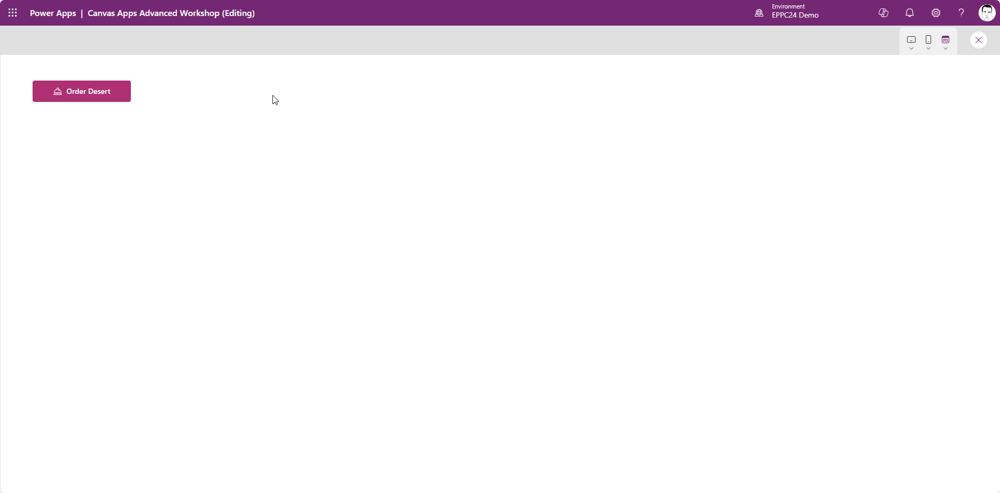
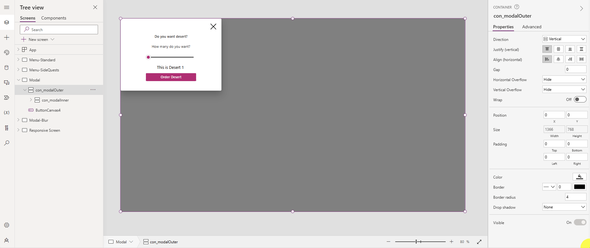
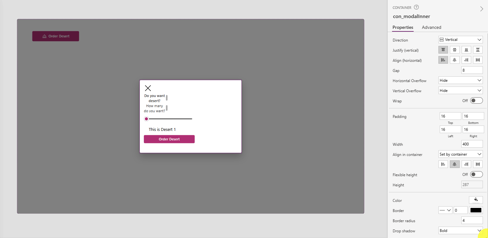
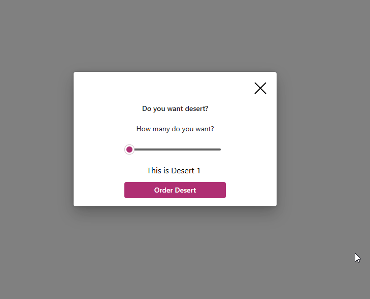
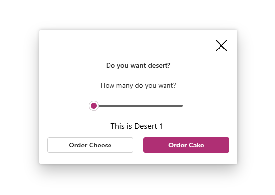
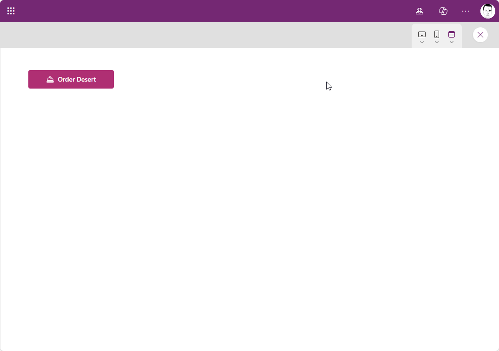

# Exercise 2-1: Create a modal with containers

The second exercise will be all about containers. First we'll be building a modal that you need in every Canvas App.




## [Main Quests overview](#user-content-main-quests)

1. Create the container structure
2. Populate the inner container
3. Show and hide the modal

## [Side quests overview](#user-content-side-quests)

1. Make the height of the modal responsive
2. add a second button
3. Create a background blur effect

## Main quests

We will continue with a new screen in our existing app.

### Create the container structure

First, we need to insert a vertical container, that covers the whole screen.
* make sure to set the `X` and `Y` properties to `0`
* set `Width` to `Parent.Width`
* set `Height` to `Parent.Height`
* set `Fill` to `RGBA(0, 0, 0, 0.5)` which will grey out the background, while the modal is visible

Inside this container we will create another vertical container
* set `Width` to `400`
* set `Height` to `300` (change later to an appropriate amount)
* set `Fill` to `Color.White`
* set `Border Radius` to `4`
* set all the `Padding` properties to `16`
* set `Gap` to `8`

Now we center the inner container. Select the outer container and set `Justify` and `Align` `Center`.


### Populate the inner container

Add some content to the inner container. Make sure to create a Close-Icon on top and a Button on the bottom to confirm your action.
Align all the content in the container as needed. (Close-Icon to the right, stretch labels, center the button)



### Show and hide the modal

This shouldn't be new for you. We will create a local variable that triggers the visibility of the outer container.

1. create an Icon or Button and set the `OnSelect` to `UpdateContext({locShowModal: true})`
2. set the `OnSelect` of the Close-Icon to `UpdateContext({locShowModal: false})`
3. set the `Visible` property of the outer container to `locShowModal`


## Side quests

### 1. Make the height of the modal responsive

Small tip if you don't know the exact height of your modal (for example, when there are auto-height texts inside):
You set the `Height` of the inner container to the position of the last element inside it:

```
btn_Confirm.Y+btn_Confirm.Height+Self.PaddingBottom
```

This should be the result:


### 2. add a second button

Modals with two side by side buttons are pretty common. Add a horizontal container inside to position the 2 buttons.



### 3. Create a background blur effect

Use an html-Text to create a blurre background instead of the greyed out background.
You can get the css code in this [Glassmorphism-Generator](https://css.glass/).


 


