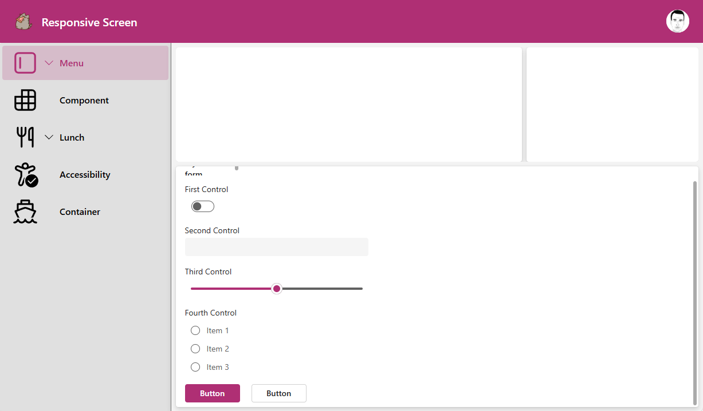
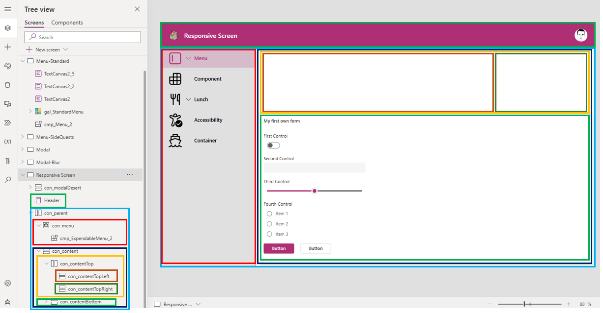
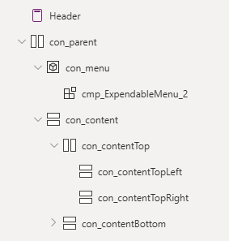

# Exercise 2-2: Create a responsive screen

In the last part we will create a whole screen with some responsiveness.

## [Main Quests overview](#user-content-main-quests)

1. Analyze the container structure
2. Create and format containers

## [Side quests overview](#user-content-side-quests)

1. Rebuild this screen from Android Auto

## Main quests

We will continue with a new screen in our existing app.

### Analyze the container structure

First of all we need to understand what the container structure looks like. In this case (and many other cases) it's completely normal to have 4 or more nested layers of containers.

### Create and format containers

Create the container structure from the example.
This is a picture of the resulting tree view:

Step by step breakdown of all the containers and other elements:

1. `Header`: One of the new composite controls. Make sure to drag it to the top-left corner and set the `Width` to `Parent.Width`
2. `con_parent`: 
  * Horizontal container, which we will put underneath the `Header`
  * `Height` to `Parent.Height-Self.Y` to fill the rest of the screen
  * `Width`to `Parent.Width`
3. `con_menu`:
  * inside `con_parent`
  * normal container
  * `Flexible Width` to `Off`
  * `Width` to `300`
  * `Align in container` to `Stretch`
  * add the menu component for additional style points
4. `con_content`:
  * Vertical container
  * inside `con_parent`
  * `Fill` to `Color.Transparent`
  * `Gap` to `8`
  * `Drop shadow` to `None` 
  * `Flexible Width` to `On`
  * `Align in container` to `Stretch`
5. `con_contentTop`:
  * Horizontal container
  * inside `con_content`
  * `Fill` to `Color.Transparent`
  * `Gap` to `8`
  * `Drop shadow` to `None` 
  * `Flexible Height` to `Off`
  * `Height` to `200`

## Side quests

### 1. Rebuild this screen from Android Auto

 

