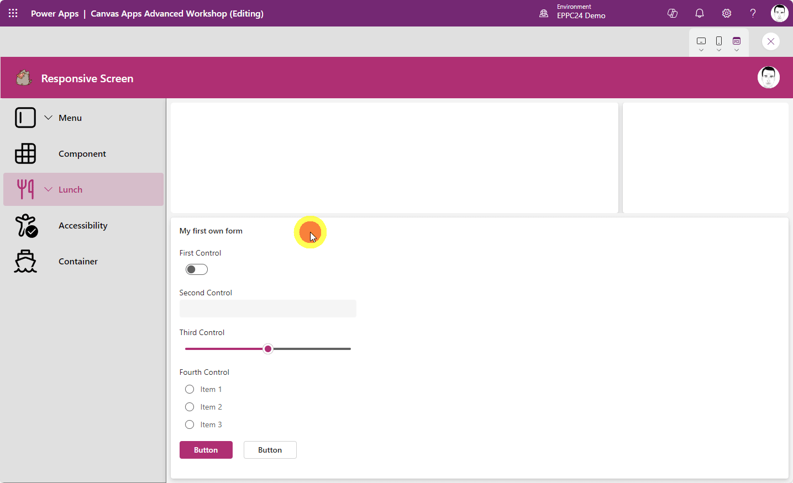

# Mastering Modern Power Apps: Build Reusable, Responsive and Robust Business Apps - EPPC24

Welcome to Mastering Modern Power Apps: Build Reusable, Responsive and Robust Business Apps! In this workshop, we will dive deep into the best practices for designing, building, and optimizing Power Apps applications, with a strong focus on accessibility. By the end of the workshop, you will have a solid understanding of how to create accessible Power Apps applications and improve your existing apps.

## Agenda

1. Choosing the right data sources for your apps
2. Good coding practices
3. How to create a reusable menu
4. A first look into modern controls
5. Intro to accessibility and why you need to take care
6. Container, container, container

## Prerequisites

From a technical standpoint we will be building a normal Canvas App without Premium features. So there is no requirement for paid licenses.

To follow this tutorial you should have build a few Canvas Apps and should be familiar with the main building blocks like galleries, buttons, etc.

## Coding exercises

In the first coding exercise, we will be building a menu component and in the second exercise, we will use containers to structure a whole screen.

### Exercise 1: Menu component

1. [create a menu](1_menu.md)
2. [make a menu component](2_component.md)

### Exercise 2: 

1. [create a modal with containers](3_modal.md)
2. [create a responsive screen](4_responsive.md)

The finished version will look something like this:

While you should try to build everything on your own, this repository will assist you in building the app, when you are stuck.
Furthermore there are side quests you can follow if you already finished the main tasks. The side quests are not discussed on this page, but the solution can be found in the reference app.

### Use the reference app

Download the reference msapp-file in the [Download-folder](downloads).

To open it in an Environemnt of your choice select `Create -> Dataverse -> Browse` and select the downloaded file.
Make sure to save the app once it has loaded

